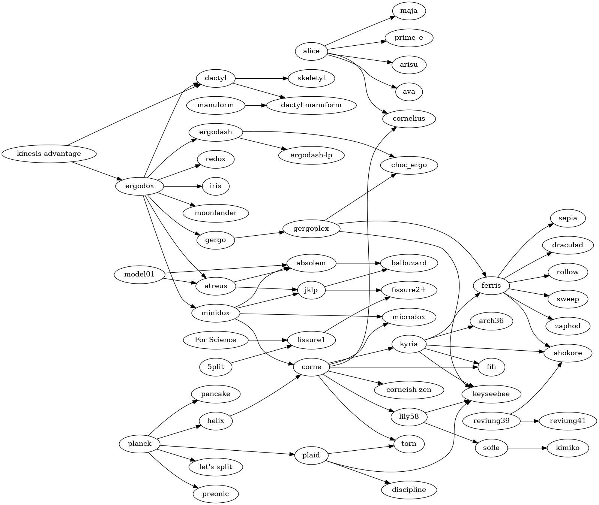

# Mechanical Keyboard Family Tree

This project aims to document the family tree of custom mechanical keyboards.

## Contributing

The MK Family Tree uses [graphviz](https://graphviz.org/doc/info/lang.html) to generate the image. If you're looking to contribute, you can add additional nodes/edges in the `tree.gv` file, and run `make` to generate the updated images in the `renders/` folder. You'll need to have `make` and `graphviz` installed to do so.